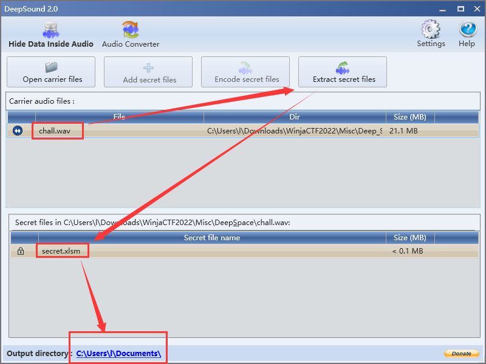

# Deep Space


from `Deep Space` I think of `deep sound tool for steg`。


Deep Sound software for Steg.

```
http://jpinsoft.net/deepsound/download.aspx
```



unzip the `secret.xlsm` file.

in the `vbaProject.bin` I found an interesting string:

```
This should be protected ? 2 5 ?  ? 66 6c 61 67 7b 39 64 33 31 38 32 64 35 61 65 33 33 63 66 32 35 33 38 30 37 31 62 63 31 65 65 66 66 38 63 65 33 5f 6d 59 5f 63 72 49 6d 65 5f 49 53 5f 74 48 61 54 5f 6f 46 5f 63 55 72 69 6f 24 31 37 79 7d
```

convert it from hex to string:

```
flag{9d3182d5ae33cf2538071bc1eeff8ce3_mY_crIme_IS_tHaT_oF_cUrio$17y}
```

